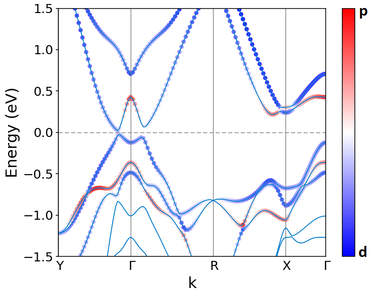

Welcome to mcu's documentation!
===============================
A package for post periodic wave function and crystallography analysis.

A quick look
------------
A projected band structure can be plotted simply by:

.. code-block:: python
    :linenos:
   
    import mcu
    mymcu = mcu.VASP()
    mymcu.plot_pband(save=True)

.. toctree::
    :maxdepth: 2
    :caption: Basic tutorials:
   
    basic
    plotting
    
Bugs and Function suggestions:
------------------------------
Bugs and more functions suggestion are appreciated

Contact
-------
* Hung Q. Pham
* Email: pqh3.14@gmail.com
   