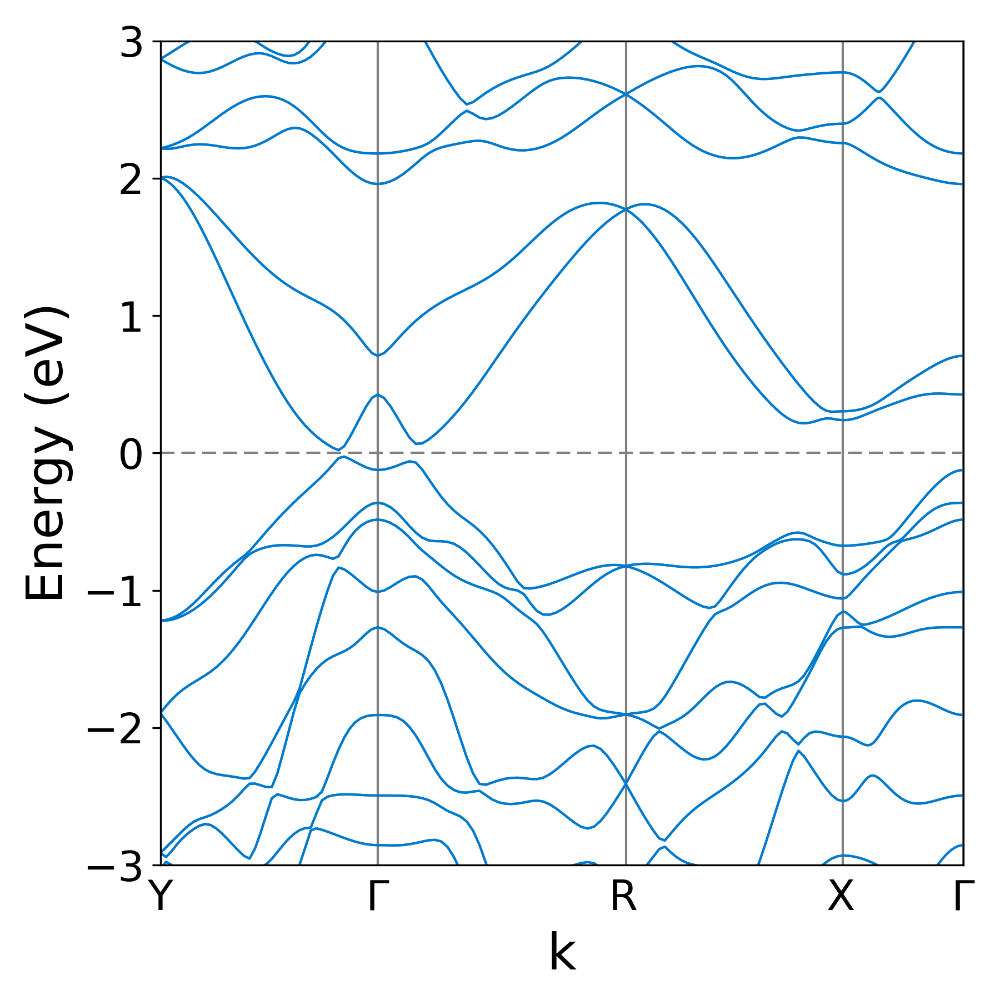
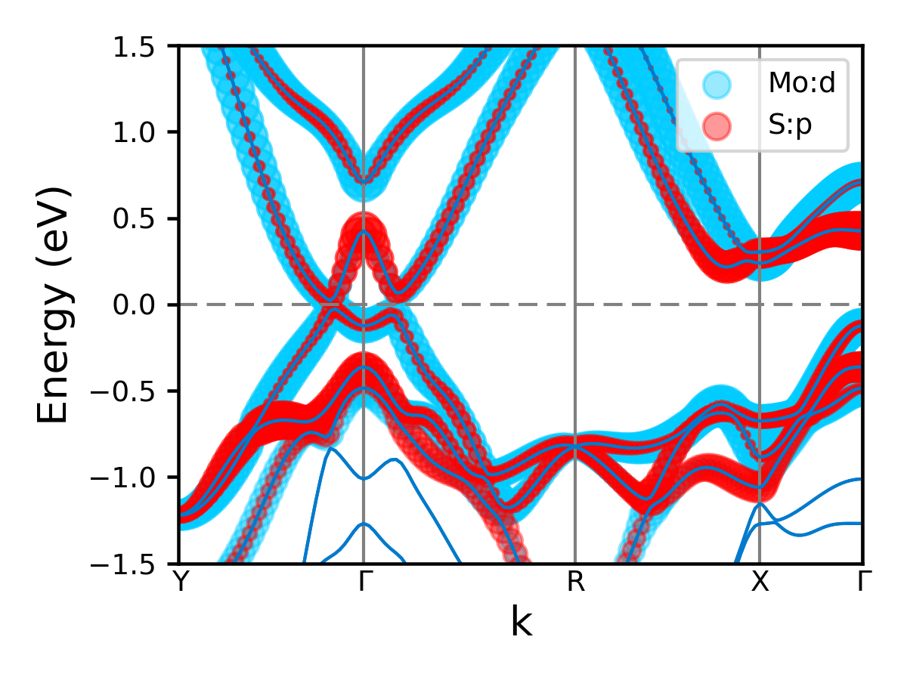
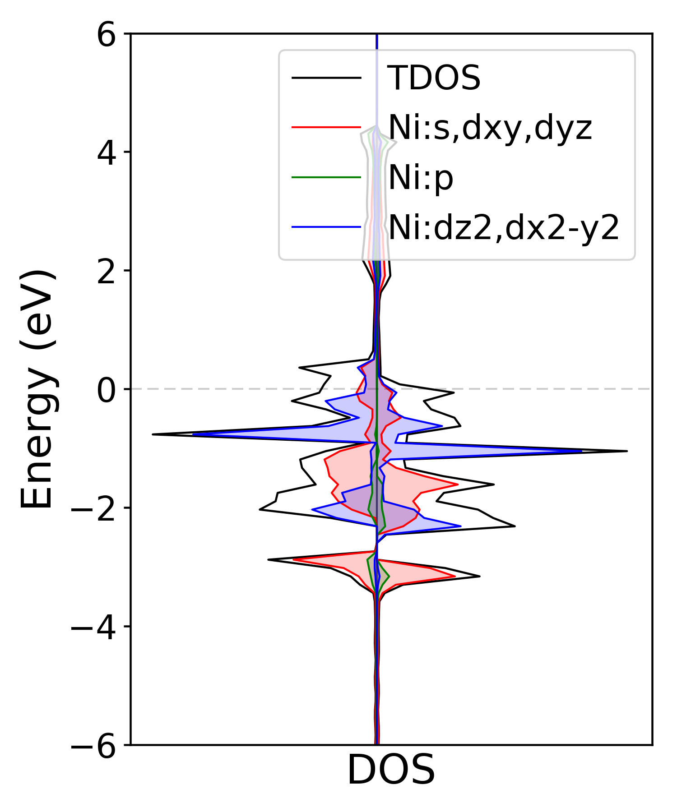

.. _plotting1D:

..
    ///////////////Band structure plotting///////////////

    
Plot band structure
===================
In python environment, band structure can be plotted by calling the **mcu.plot_band()** function

.. code-block:: python
    :linenos:
   
    import mcu           
    mymcu = mcu.VASP()    # or mymcu = mcu.VASP(path='path-to-vasprun', vaspruns='vasprun')             
    mymcu.plot_band()

To customize the band, one can modify some of these attributes. For mcu/example/MoS2, you can run: 

.. code-block:: python
    :linenos:
   
    import mcu           
    mymcu = mcu.VASP()   
    mymcu.plot_band(spin=0, save=True, label='Y-G-R-X-G', fontsize= 9, ylim=(-3,3), figsize=(3,3), dpi=300, format='png')
    
You should get:

    
All parameters and their defaults of **plot_band** function are given below. Most of the parameters are passed to matplotlib functions.
So more information can be found in matplotlib docs.

Parameters
~~~~~~~~~~
efermi : float
    * Default: fermi level from vasprun.xml or OUTCAR
    * User can shift the Fermi level to a value
spin : int
    * Default: 0
    * If ISPIN = 1: spin = 0
    * If ISPIN = 2: spin = 0 (Up spin) or 1 (Down spin)
label : str or list
    * Default: None 
    * For conventional band structure, e.g. label = 'X-G-Y-L-G'
    * For hydrib functional band structure, e.g. label = [['L',0.50,0.50,0.50],['G',0.0,0.0,0.00],['X',0.5,0.0,0.50],['W',0.50,0.25,0.75]]
save : bool 
    * Default: False
    * True to save to an image    
band_color: list
    * Default: ['#007acc','#808080','#808080']
    * Three color codes indice color of band curve, kpoint grid, Fermi level, respectively. 
    * Exp: ['k','#808080','r']
    * Hex color code can be found here `here <https://www.w3schools.com/colors/colors_picker.asp>`_
figsize : tuple or list
    * Default: De(6,6)
    * Size of image in inch
figname : str
    * Default: 'BAND'
    * Name of the image
xlim : list or tuple 
    * Default: None
    * Limit range for momentum (k) axis. Used when to zoom in a specific range of k with the unit :math:`Angstrom^{-1}` 
ylim : list or tuple 
    * Default: [-6,6]
    * Limit range for energy axis in eV
fontsize : int
    * Default: 18
    * Font size
dpi : int
    * Default: 600
    * Resolution of the image 
format : str
    * Default: 'png'
    * Extension of the image

..
    ///////////////Projected band structure plotting///////////////   
    
Plot projected band structure
=============================
In python environment, band structure can be plotted by calling the **mcu.plot_band()** function

.. code-block:: python
   :linenos:
   
   import mcu           
   mymcu = mcu.VASP()               
   mymcu.plot_pband()
   
To customize the band, one can modify some of these attributes. For mcu/example/MoS2, you can run:

.. code-block:: python
    :linenos:
   
    import mcu           
    mymcu = mcu.VASP()   
    label = 'Y-G-R-X-G'
    mymcu.plot_pband(style=2, lm=['Mo:d','S:p'], color=['#00ccff','#ff0000'], alpha=0.4, label=label, fontsize= 9, ylim=(-1.5,1.5),figsize=(4,3),legend=['Mo:d','S:p'],legend_size=1.2, save=True, figname='MoS2_style2', dpi=300)

You should get:

    
Or for style = 3:

.. code-block:: python
    :linenos:
   
    import mcu           
    mymcu = mcu.VASP()   
    label = 'Y-G-R-X-G'
    mymcu.plot_pband(style=3, lm='pd', label=label, fontsize= 9, scale=0.5, ylim=(-1.5,1.5), figsize=(4,3), save=True, figname='MoS2_style3', dpi=300)

.. image:: ../image/MoS2_style3.png
    :scale: 50 %
    :align: center
    
All parameters and their defaults of **plot_pband** function are given below. Most of the parameters are passed to **plot_band** function.
Some of additional parameters for projected band structure. Most important parameters are **style** and **lm**. 

Parameters
~~~~~~~~~~
efermi : float
    * Default: fermi level from vasprun.xml or OUTCAR
    * User can shift the Fermi level to a value
spin : int
    * Default: 0
    * If ISPIN = 1: spin = 0
    * If ISPIN = 2: spin = 0 (Up spin) or 1 (Down spin)
label : str or a list of str
    * Default: None 
    * For conventional band structure, e.g. label = 'X-G-Y-L-G'
    * For hydrib functional band structure, e.g. label = [['L',0.50,0.50,0.50],['G',0.0,0.0,0.00],['X',0.5,0.0,0.50],['W',0.50,0.25,0.75]]
band_color: list
    * Default: ['#007acc','#808080','#808080']
    * Three color codes indice color of band curve, kpoint grid, Fermi level, respectively. 
    * Exp: ['k','#808080','r']
    * Hex color code can be found here `here <https://www.w3schools.com/colors/colors_picker.asp>`_
style : int
    * Default: 1
    * If style = 1: the most flexible style, all atoms are considered. A few examples of **lm** are:
        - Choose one specific orbital: lm = 's' or  lm = 'p' or lm = 'dxz' or lm = 'dx2-y2'
        - Shortcut: lm = 'sp' for 's', 'p' or lm  = 'spd' for s, p, d or  lm  = 'dsp' for d, s, p (where orbital appears later will be on top of other orbitals before in plotting) 
        - lm = [['s', 'py', 'pz'],['dxy', 'dyz', 'dz2']]
        - Each color is used for each **lm** or each **lm** group
        - The marker's radius is proportional to the % of lm
    * If style = 2: user can specify atom and orbitals belong to that atom. A few examples of **lm** are:
        - Only one certain atom is chose: lm = 'Ni:s' or lm = 'Ni:s,p'
        - More than one atoms are considered: lm = ['Ni:s','C:s,pz']
        - Each color is used for each **lm** or each **lm** group
    * If style = 3: a colormap is used to show the transition between two **lm** values. . For example:
        - lm = 'sp'     : transition between s and p 
        - lm = 'dp'     : transition between d and p 
        - A color map is used. Hence, user can choose a **cmap**, *e.g.* cmap = 'bwr'
lm : str or a list of str
    * Default: 'spd'
    * Depend onf the *style*, corresponding lm values can be specified.
band : list
    * Default: None
    * If band = None, roughly five conduction bands and five valence bands are chosen to plot
    * User can provide a list of of two index numbers for bands. For example, [3,10] means that there are eight bands from the 3rd band to the 10th band.
      For the whole band, band = [0,100000] or  band = [0,1000] as long as the second number is larger than the available bands (> NBANDS)
color : list
    * Default: None
    * By default, there is a list of random color codes in plot_pband functions can be used. It is not used if **style** = 3
    * User can provide a list of color they wish to use. For example, ['r','#ffffff,'k']. 
      Just need to make sure the numbers of color code should match with the numbers of group of orbitals plotted.
      For example, lm ='spd' then there should be a list of three color codes. 
    * Hex color code can be found here `here <https://www.w3schools.com/colors/colors_picker.asp>`_
scale : float
    * Default: 1.0
    * Used to adjust the size of the marker
alpha : float
    * Default: 0.5
    * Used to adjust the transparency of the marker
cmap : str
    * Default: 'bwr'
    * Colormap used in style = 3. Other colormap type can be found `here <https://matplotlib.org/tutorials/colors/colormaps.html>`_ 
edgecolor : 
    * Default: 'none'
    * The marker's border color in the style 3
facecolor : None
    * Default: 'none'
    * The filling color of style 1 and 2
    * facecolor = None : taking from the **color** list
    * facecolor = 'none' : unfilling markers   
    * facecolor = [True, False, True] : following the **lm** orders, where True indicates filling marker and vice versa   
    
marker : str or a list of str
    * Default: 'o'
    * marker = 'o' means 'o' used for all lm
    * marker = ['o','H'] and lm ='sp' means 'o' used s orbitals and 'H' used for p orbitals.
    * More detail about marker type can be found `here <https://matplotlib.org/api/markers_api.html>`_ 
legend : list of str
    * Defaul: None
    * A list of labels for different group of orbitals. For example, ['Mo_s','S_p']
loc : 
    * Defaul: "upper right"
    * Location of legend 
    * Possile **loc** value can be found `here <https://matplotlib.org/api/_as_gen/matplotlib.pyplot.legend.html>`_ . Look for 'Location String' or 'Location Code'
legend_size : float
    * Default: 1.0
    * Size of the legend
save : bool 
    * Default: False
    * True to save to an image    
figsize : tuple or list
    * Default: De(6,6)
    * Size of image in inch
figname : str
    * Default: 'BAND'
    * Name of the image
xlim : list or tuple 
    * Default: None
    * Limit range for momentum (k) axis in eV. Used when to zoom in a specific range of k with the unit :math:`\AA^{-1}` 
ylim : list
    * Default: [-6,6]
    * Limit range for energy axis in eV
fontsize : int
    * Default: 18
    * Font size
dpi : int
    * Default: 600
    * Resolution of the image 
format : str
    * Default: 'png'
    * Extension of the image
  
..
    ///////////////Density of states plotting///////////////  
    
Plotting density of states
==========================
For DOS, the total DOS is always shown together with projected DOS (if computed). For mcu/example/Ni, you can run

.. code-block:: python
   :linenos:
   
    import mcu           
    mymcu = mcu.VASP()  
    mymcu.plot_dos()
    
.. image:: ../image/Ni_horizontal.png
    :scale: 30 %
    :align: center
    
To customize the dos figure, one can modify some of these attributes.
   
.. code-block:: python
   :linenos:
   
    import mcu           
    mymcu = mcu.VASP()  

    # Style = 2 and spin = 'updown'
    mymcu.plot_dos(spin = 'updown', style = 2, lm = ['Ni:s,dxy,dyz','Ni:p','Ni:dz2,dx2-y2'], save=True, figname='Ni_updown', dpi=300)

You should get:
    

    
All parameters and their defaults of **plot_dos** function are given below.

Parameters
~~~~~~~~~~
vasprun : object
    * Defaul: None
    * If multiple vasprun.xml files are used when defining a mcu object then user can pick of of those. By default, the first vasprun.xml in the list will be used
style : int
    * Default: 1
    * style = 1 (standard plot) or style = 2 (vertital plot)
efermi : float
    * Default: fermi level from vasprun.xml or OUTCAR
    * User can shift the Fermi level to a value
spin : int
    * Default: 0
    * If ISPIN = 1: spin = 0
    * If ISPIN = 2: spin = 0 (Up spin) or 1 (Down spin). spin = 'updown' means plotting both alpha and beta electrons
    * For LSORBIT = True: spin = 0 (total m) or spin = 1 (mx) or spin = 2 (my) or spin = 3 (mz)
lm : str or a list of str
    * Default: DOS is projected on each atom.
    * Example: 'Ni:s' or ['Ni:s','C:s,px,pz']
color : list
    * Default: None
    * By default, there is a list of random color codes in plot_pband functions can be used. It is not used if **style** = 3
    * User can provide a list of color they wish to use. For example, ['r','#ffffff,'k']. 
      Just need to make sure the numbers of color code should match with the numbers of group of orbitals plotted.
      For example, lm ='spd' then there should be a list of three color codes. 
    * Hex color code can be found here `here <https://www.w3schools.com/colors/colors_picker.asp>`_
legend : list of str
    * Defaul: None
    * A list of labels for different group of orbitals. For example, ['Mo_s','S_p']
loc : 
    * Defaul: "upper right"
    * Location of legend 
    * Possile **loc** value can be found `here <https://matplotlib.org/api/_as_gen/matplotlib.pyplot.legend.html>`_ . Look for 'Location String' or 'Location Code'
fill : bool
    * Default: True
    * Whether to fill the area below the DOS curve.
alpha : float
    * Default: 0.2
    * Used to adjust the transparency of the marker
save : bool 
    * Default: False
    * True to save to an image    
figsize : tuple or list
    * Default: (6,6)
    * Size of image in inch
figname : str
    * Default: 'DOS'
    * Name of the image
elim : list
    * Default: [-6,6]
    * Limit range for energy axis in eV
yscale : float
    * Default: 1.1
    * Used to zoom in and out the horizontal or DOS axis
fontsize : int
    * Default: 18
    * Font size
dpi : int
    * Default: 600
    * Resolution of the image 
format : str
    * Default: 'png'
    * Extension of the image
    
Work function and the electrostatic potential over a plane 
==========================================================

The work function :math:`\Phi` is defined as:

.. math::
    \Phi = - E_{VBM} = E_{Vacuum} - \epsilon_F

where :math:`\epsilon_F` and :math:`E_{Vacuum}` are the Fermi level and the electrostatic potential of vacuum, respectively.
The :math:`E_{Vacuum}` can be computed by simply constructing a slab model and adding LVTOT = .TRUE. to INCAR in VASP calculation. 
LOCPOT file , where the electrostatic potential is computed on the fine FFT-grid, will be generated as a result.
The average over a plane perpendicular to an crystal axis can be computed and plotted via **mcu**. 

You can run the below commands in the mcu/example/InCuCl directory

.. code-block:: python 
    :linenos:
   
    import mcu           
    mymcu = mcu.LOCPOT()          
    mymcu.plot(axis='z', error=0.01)
     
You should get:

.. image:: ../image/elecpot.png
    :scale: 20 %
    :align: center
    
In case you want to get the electrostatic potential data and plot it yourself

.. code-block:: python
    :linenos:
   
    import mcu           
    mymcu = mcu.LOCPOT()          
    pot = mymcu.get_2D_average(axis='z')                       # an 2 dimensional array [x,y] with x is the coordinates and y is the potential
    e_vacuum = mymcu.get_2D_average(axis='z', error=0.01)      # to get E_vacuum    
    
All parameters and their defaults of **plot** function are given below.
    
Parameters
~~~~~~~~~~
axis : str
    * Default: 'z' 
    * The average of electrostatic potential is computed over a plane that is perpendicular to this axis 
error : float
    * Default: 0.01 
    * The electrostatic potential (pot) at the vacuum is computed by taking the average of all the pot in the window (pot - 2*error, maximum of pot) 
color : list 
    * Default: ['r', '#737373']
    * The color codes for the electrostatic potential and the vacuum marker
ylim : list
    * Default: None, automatic estimated
    * Limit range for energy axis in eV
save : bool 
    * Default: False
    * True to save to an image   
figsize : tuple or list
    * Default: (8,6)
    * Size of image in inch
figname : str
    * Default: 'elecpot'
    * Name of the image
fontsize : int
    * Default: 18
    * Font size
dpi : int
    * Default: 600
    * Resolution of the image 
format : str
    * Default: 'png'
    * Extension of the image