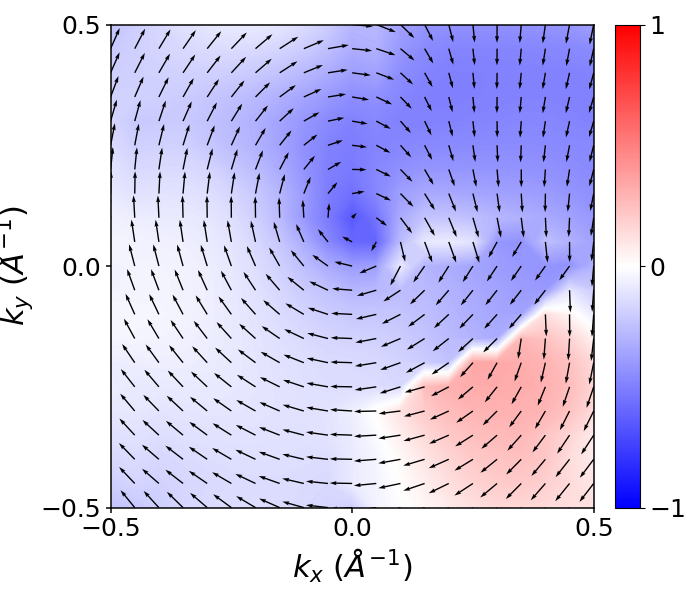

.. _plotting2D:

..
    ///////////////2D band structure///////////////   
    
Generate 2D k-mesh
==================

POSCAR is needed to to get the lattice information. 
the following command generates a k-mesh (-0.2 <= x <= 0.2 and -0.2 <= y <= 0.2) on the xy plan and around the :math:`\Gamma` point with 21 points along each dimension.

.. code-block:: python 
    :linenos:
   
    import mcu           
    mymcu = mcu.POSCAR() 
    mymcu.get_2D_kmesh(origin=[0,0,0], krange=[0.2,0.2], plane='xy', npoint=[21,21])  

You should get the KPOINTS file generated. This is not done yet. 
Copy the k-mesh block in IBZKPT file to the KPOINTS file and do a simple math to figure out how many k-points in total. 
This new KPOINTS file should be ready for band structure calculation step. 

Parameters
~~~~~~~~~~    
origin : list
    * Default: [0,0,0] or :math:`\Gamma` point
    * Fractional coordinates of the origin of the mesh
krange : list
    * Default: [0.1,0.1]
    * The first indicates -0.2 <= x <= 0.2, similarly for the second dimension.
plane : str
    * Default: 'xy'
    * Options: 'xy', 'xz', 'yz'
npoint : list
    * Default: [11,11]
    * Number of k-points along each dimension
    
Plot 2D band structure
======================

2D band structure can be generated by following this procedure

    * Run a conventional SCF calculation to get WAVECAR
    * Generate KPOINTS file for a 2D k-mesh using mcu
    * Run band structure calculation using the new KPOINTS file 

After finishing the calculation, you should be able to plot it simly by: 

.. code-block:: python 
    :linenos:
   
    import mcu           
    mymcu = mcu.VASP()
    mymcu.plot_band2D()

You can run the following example in the /mcu/example/Graphene_2D directory. You should get:

.. image:: ../image/gra_band2D.png
    :scale: 60 %
    :align: center

All parameters and their defaults of **plot_band** function are given below. Most of the parameters are passed to matplotlib functions.
So more information can be found in matplotlib docs.

Parameters
~~~~~~~~~~
efermi : float
    * Default: fermi level from vasprun.xml or OUTCAR
    * User can shift the Fermi level to a value
spin : int
    * Default: 0
    * If ISPIN = 1: spin = 0
    * If ISPIN = 2: spin = 0 (Up spin) or 1 (Down spin)
band : list
    * Default: VBM and CBM
    * Which bands to plot
cmap : str
    * Default: 'bwr'
    * Colormap used in style = 3. Other colormap type can be found `here <https://matplotlib.org/tutorials/colors/colormaps.html>`_ 
save : bool 
    * Default: False
    * True to save to an image    
figsize : tuple or list
    * Default: De(6,6)
    * Size of image in inch
figname : str
    * Default: 'BAND2D'
    * Name of the image
xlim : list or tuple 
    * Default: from k-mesh
    * Plotting range for 1st momentum (k). Unit :math:`Angstrom^{-1}` 
ylim : list or tuple 
    * Default: from k-mesh
    * Plotting range for 2nd momentum (k). Unit :math:`Angstrom^{-1}` 
zlim : list or tuple
    * Default: from band values
    * Plotting range for energy (eV)     
fontsize : int
    * Default: 18
    * Font size
dpi : int
    * Default: 600
    * Resolution of the image 
format : str
    * Default: 'png'
    * Extension of the image
    
..
    ///////////////Spintexture///////////////   
    
Plot spin texture
===========================
    
Spin texture can be generated by following the same procedure as 2D band structure except that one should add the key word LSORBIT = .TRUE. for SOC in INCAR file.
After finishing the calculation, you should be able to plot it simly by: 

.. code-block:: python 
    :linenos:
   
    import mcu           
    mymcu = mcu.VASP()
    mymcu.plot_spin(band=2)

You can run the following example in the /mcu/example/MoS2_spintexture directory. You should get:

    
All parameters and their defaults of **plot_spin** function are given below. Most of the parameters are passed to matplotlib functions.
So more information can be found in matplotlib docs.

Parameters
~~~~~~~~~~
style : int
    * Default: 1
    * Style = 1: the colormap for the third dimension is in the background
    * Style = 2: the colormap for the third dimension is in the arrows themselves
lm : str or list of str 
    * Default: all the atoms and lm
    * Use can specify an orbital or a list of them, *e.g.* 'Ni:s' or ['Ni:s','C:pz']
band : int
    * Default: VBM
    * spin texture is plot for this band
cmap : str
    * Default: 'bwr'
    * Colormap used in style = 3. Other colormap type can be found `here <https://matplotlib.org/tutorials/colors/colormaps.html>`_ 
color : str
    * Default: 'k'
    * The color of the arrows used in the style = 1. No effect if style = 2
scale : int
    * Default: 15
    * Used to adjust the length of the arrow. The smaller the scale, the longer the arrows.
scale_units : str
    * Default: None
    * Used together with **scale** to play with the arrow's length. Check `here <https://matplotlib.org/api/_as_gen/matplotlib.pyplot.quiver.html>`_ for more details 
save : bool 
    * Default: False
    * True to save to an image    
figsize : tuple or list
    * Default: De(6,6)
    * Size of image in inch
figname : str
    * Default: 'spin_texture'
    * Name of the image
xlim : list or tuple 
    * Default: from k-mesh
    * Plotting range for 1st momentum (k). Unit :math:`Angstrom^{-1}` 
ylim : list or tuple 
    * Default: from k-mesh
    * Plotting range for 2nd momentum (k). Unit :math:`Angstrom^{-1}`     
fontsize : int
    * Default: 18
    * Font size
dpi : int
    * Default: 600
    * Resolution of the image 
format : str
    * Default: 'png'
    * Extension of the image